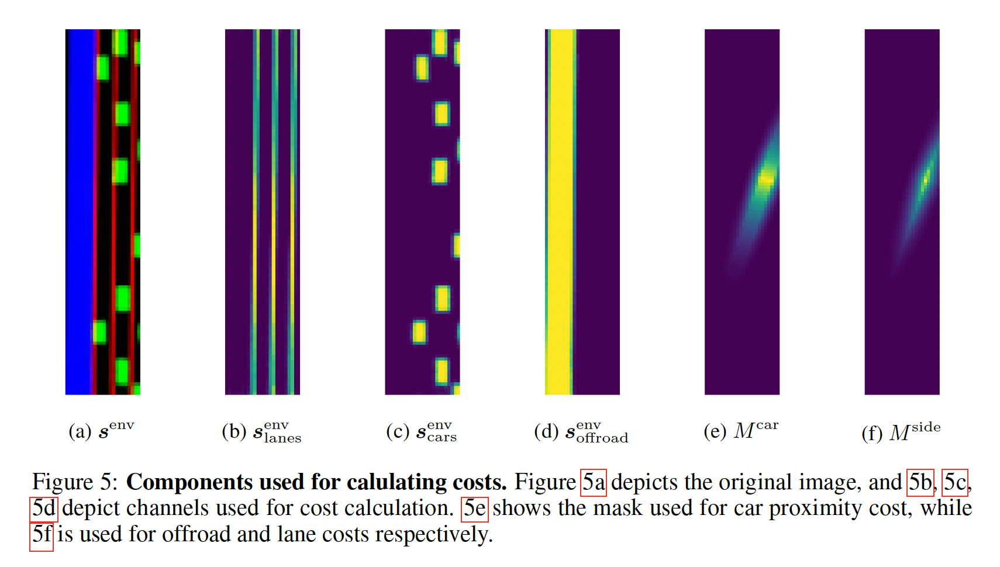
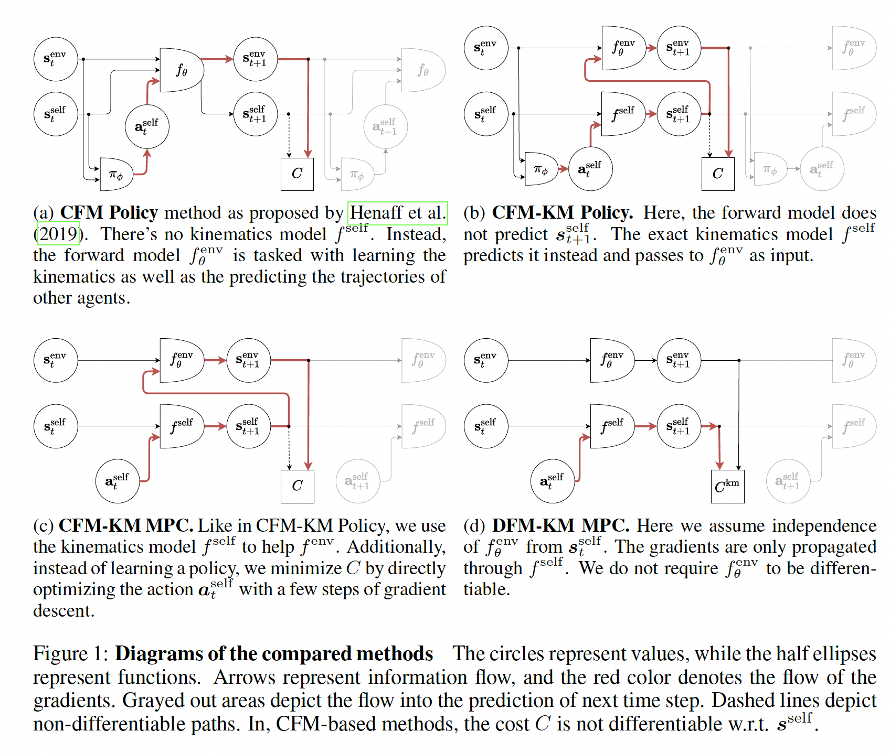
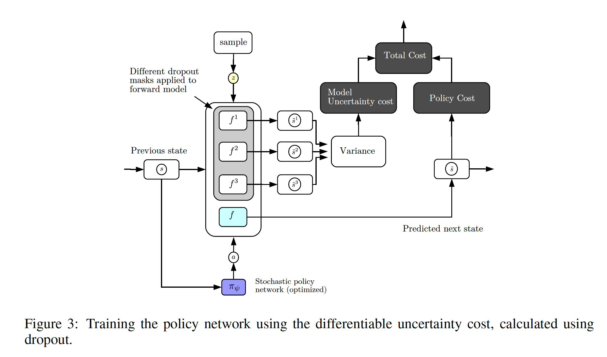
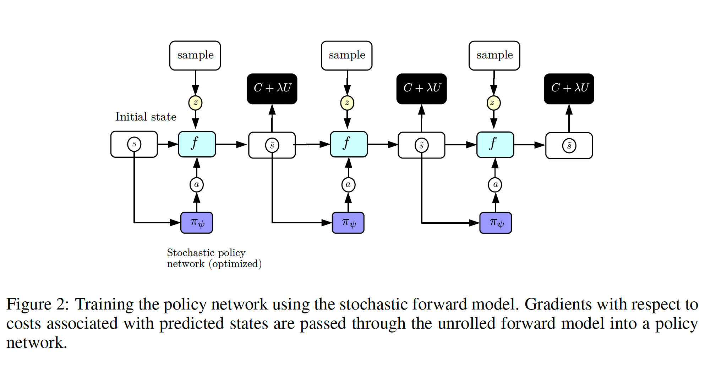
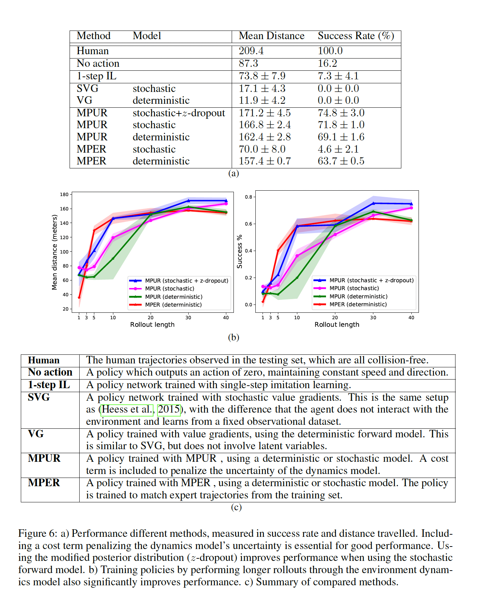

### Autonomous Driving under Distribution Shift and Safety Constraints

In real-world autonomous driving, the situations a vehicle encounters can differ drastically from those seen in the training dataset. Rare but safety-critical events—such as a pedestrian or scooter suddenly cutting in—may push the model far outside its training distribution, causing unexpected and potentially dangerous behaviors (for example, steering off the road to avoid a collision and crashing into the guardrail instead).  

From a reinforcement learning perspective, learning a robust driving policy in principle requires a large number of interactions with the environment. However, allowing a physical vehicle to explore and “trial-and-error” in the real world is both prohibitively dangerous and expensive. This motivates model-based approaches that can capture diverse traffic situations while remaining controllable and safe to optimize.

In this project, we follow two recent lines of work that address these challenges:

1. [**Model-Predictive Policy Learning with Uncertainty Regularization for Driving in Dense Traffic**](https://openreview.net/forum?id=HygQBn0cYm)
2. [**Separating the World and Ego Models for Self-Driving**](https://arxiv.org/abs/2204.07184)

Together, they provide: (i) a **differentiable MPC framework** with interpretable cost masks and a physically grounded ego-vehicle model, and (ii) a method to **quantify model uncertainty** that encourages the policy to act only in regions where the model is confident.

---
### (1) Differentiable Cost Mask Construction

In *Separating the World and Ego Models for Self-Driving*, the authors define differentiable cost masks that align with the ego vehicle’s predicted pose and orientation. Their approach centers the cost mask on the agent and applies rotation and translation to match the vehicle’s heading, ensuring the cost representation remains aligned with the ego state. This setup ensures that all operations involved in cost computation are differentiable with respect to the ego parameters $ (x, y, u_x, u_y, s) $, enabling end-to-end gradient-based optimization.

The authors construct two types of masks: one for proximity cost and one for offroad or lane costs. They define safety margins in the longitudinal and lateral directions as:

$$
d_x = 1.5 \cdot (\max(10, s) + l) + 1, \quad d_y = \frac{w}{2} + 3.7
$$

Using these bounds, the masks are constructed to smoothly decay from 1 at the vehicle's boundary to 0 beyond the safety margins. The mask functions are given as:

$$
M^{\text{car}}_{i,j} = \left[ \left( \frac{d_x - |B_{i,j,1}|}{d_x - l/2} + \min \left( \frac{d_y - |B_{i,j,2}|}{d_y - w/2}, 1 \right) \right)^\alpha \right]^+
$$

$$
M^{\text{side}}_{i,j} = \left[ \left( \frac{d_x - |B_{i,j,1}|}{d_x - l/2} + \frac{d_y - |B_{i,j,2}|}{d_y - w/2} \right)^\alpha \right]^+
$$

Here, $ B_{i,j} $ are the transformed coordinates aligned with the agent’s frame, and $ \alpha $ is a nonlinearity hyperparameter controlling the mask sharpness. The operator $[\,]^+$ denotes clamping to non-negative values.

These masks allow the model to encode interpretable and spatially structured costs, such as for lane boundaries or vehicle proximity, while remaining fully differentiable through the ego dynamics.

---
### Kinematic bicycle model for the ego vehicle

The ego dynamics are given by a simple kinematic bicycle model. Let $(x_t, y_t)$ denote the position of the ego vehicle, $s_t$ its speed, and $u_t = (u_t^x, u_t^y)$ a unit vector pointing along the current heading. The control input
$$
a_t^{\text{self}} = (a_{t,0}, a_{t,1})
$$
consists of the longitudinal acceleration $a_{t,0}$ and a turning command $a_{t,1}$. With time step $\Delta t$, the dynamics are
$$
\begin{aligned}
x_{t+1} &= x_t + s_t u_t^x \Delta t, \\
y_{t+1} &= y_t + s_t u_t^y \Delta t, \\
s_{t+1} &= s_t + a_{t,0} \Delta t, \\
(u_{t+1}^x, u_{t+1}^y) &= \operatorname{unit}\big[(u_t^x, u_t^y) + a_{t,1} \Delta t \,(u_t^y, -u_t^x)\big],
\end{aligned}
$$
where $\operatorname{unit}(v) = \dfrac{v}{\lVert v \rVert}$ normalizes a vector to unit length.

Intuitively, the first three equations update the vehicle’s position and speed according to its current heading, while the last equation rotates the heading vector based on the turning command. This physics-based kinematic model makes the ego dynamics interpretable and differentiable, and gradients in DFM-KM MPC are propagated only through this ego model.

---
### (2) Cost Design and DFM-KM MPC

Building on Sobal et al., we adopt a **separated world model** consisting of:

- an **ego model** $f^{\text{self}}$, given by a differentiable kinematic model of the ego vehicle, and  
- an **environment model** $f_\theta^{\text{env}}$, which predicts the rasterized environment state (lanes, other cars, and off-road regions).

The trajectory cost is computed as a weighted sum of interpretable components:
$$
C = \alpha_{\text{lane}} C_{\text{lane}}
   + \alpha_{\text{offroad}} C_{\text{offroad}}
   + \alpha_{\text{proximity}} C_{\text{proximity}}
   + \alpha_{\text{destination}} C_{\text{destination}}
   + \alpha_{\text{jerk}} C_{\text{jerk}}.
$$

The first three terms are defined as pointwise inner products between environment channels and fixed cost masks:
$$
C_{\text{lane}} = \langle s_{\text{lanes}}^{\text{env}}, M^{\text{side}} \rangle, \quad
C_{\text{offroad}} = \langle s_{\text{offroad}}^{\text{env}}, M^{\text{side}} \rangle, \quad
C_{\text{proximity}} = \langle s_{\text{cars}}^{\text{env}}, M^{\text{car}} \rangle,
$$
where $s_{\text{lanes}}^{\text{env}}$, $s_{\text{cars}}^{\text{env}}$, and $s_{\text{offroad}}^{\text{env}}$ denote the lane, other vehicles, and road-boundary channels of the predicted environment state, while $M^{\text{side}}$ and $M^{\text{car}}$ are pre-defined cost masks for lane keeping and collision avoidance with $M^{\text{side}}$ and $M^{\text{car}}$ visualized in Figure 5 of Separating the World and Ego Models for Self-Driving.

The remaining terms enforce progress and smoothness:
$$
C_{\text{destination}} = -x,
$$
which penalizes staying near the starting position and encourages forward motion along the road, and
$$
C_{\text{jerk}} = \frac{1}{T} \sum_{t=2}^{T}
  \left(a_t^{\text{self}} - a_{t-1}^{\text{self}}\right)^{\!\top}
  \left(a_t^{\text{self}} - a_{t-1}^{\text{self}}\right),
$$
which discourages abrupt changes in the ego vehicle’s actions.

In the **DFM-KM MPC** setting (Figure 1d), the ego state is propagated purely by the kinematic model $f^{\text{self}}$, and gradients are back-propagated only through this ego model when optimizing the action sequence. The environment model $f_\theta^{\text{env}}$ is used to predict the surroundings (potentially with dropout, as above), but it does not need to be differentiable with respect to the ego state. This separation yields a stable and interpretable MPC pipeline: the physics-based ego model handles the vehicle’s motion, while the learned environment model and cost masks encode where it is safe or dangerous to go.

---

### (3) Quantifying Uncertainty: Encouraging the Policy to Stay Confident

Following Henaff et al., we train a stochastic world model and a stochastic policy jointly. During training, **dropout** is applied to the forward model: each forward pass samples a Bernoulli mask
$$
z \sim \mathcal{B}(p_u),
$$
which randomly turns off a subset of neurons (see Figure 3 from Model Predictive Policy Learning with Uncertainty Regularization for Driving in Dense Traffic), where p_u is the dropout probability and B denotes the Bernoulli distribution. Running the same state–action pair through multiple dropout masks yields an ensemble of predicted next states. The **model uncertainty cost** is then defined as the sum of the variances over these predictions. Intuitively, if the world model is highly uncertain about what will happen next, the resulting variance will be high.
$$U(\hat{s}_{t+1})=\text{tr}[\text{Cov}[\{f_{\theta_k}(s_{1:t}, a_t,z_t)\}_{k=1}^K]]=\displaystyle\sum_{j=1}^d\text{Var}(\{f_{\theta_k}(s_{1:t},a_t,z_t)_j\}_{k=1}^K)$$

The total cost used to train the policy combines a standard policy cost with this uncertainty cost:
$$
C_{\text{total}} = C_{\text{policy}} + \lambda U.
$$
Minimizing $C_{\text{total}}$ encourages the policy to choose actions that not only achieve good driving behavior but also keep the system within regions where the model is confident, effectively pushing the agent to “do what it knows well”.

---

#### Receding-horizon MPC with $T$-step rollouts

At each decision step, the controller predicts the evolution of the ego state and the environment over a finite horizon of $T$ steps, where $T$ is treated as a hyperparameter. Given the current state $s_t$, DFM-KM MPC optimizes over a sequence of ego actions
$$
a_{t:t+T-1}^{\text{self}}
= \{a_t^{\text{self}}, a_{t+1}^{\text{self}}, \dots, a_{t+T-1}^{\text{self}}\}
$$
to minimize the cumulative cost
$$
J_t = \sum_{\tau=t}^{t+T-1} C\big(s_\tau^{\text{self}}, s_\tau^{\text{env}}, a_\tau^{\text{self}}\big).
$$

Only the **first** action $a_t^{\text{self}}$ of the optimal sequence is executed on the real system. At the next time step, the horizon is shifted forward and the optimization problem is solved again with the updated state. This receding-horizon scheme allows the controller to look ahead over T steps while **remaining** reactive to new observations.

Empirically, using longer rollouts and incorporating the uncertainty cost leads to a clear improvement in both mean travelled distance and success rate compared to baseline methods, as shown in the experimental results (e.g., Figure 6 in Henaff et al.).
